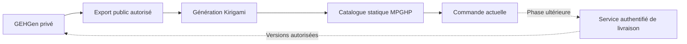

# GEHGen et le nouveau site

## Capacités réellement examinées

Dépôt : `C:\projects\mpghp\gehgen`. Sources examinées : README, CLAUDE, docs/STATUS, docs/TODO, docs/AUTHZ, docs/GENERATION, src/index.php et les vues d’impression des questionnaires. La documentation d’état décrit un déploiement existant; aucun test de production n’est effectué ici.

GEHGen gère des questions par thème, catégorie, niveau et type, des gabarits et saisons, une génération avec réservations et fenêtre de non-réutilisation, un cycle de révision, et des questionnaires approuvés figés. La sortie examinée est un document HTML imprimable. Un service de génération PDF automatisé n’est pas établi par cette lecture.

Les routes examinées sont celles d’une application PHP/MariaDB authentifiée. Les actions POST internes ne constituent pas un contrat d’API publique pour la vitrine. Les rôles actuels sont rédaction, révision et administration; ils ne définissent pas encore les droits d’achat d’une école.

## Fonctionnalités à envisager

| Priorité | Fonction visible | Ce que GEHGen apporte | Ce qu’il faut ajouter |
|---|---|---|---|
| 1 | Catalogue par niveau et saison | Gabarits, niveaux, saisons et versions | Export de métadonnées explicitement publiables, disponibilité commerciale confirmée |
| 1 | Exemples pour découvrir le jeu | Structure des questions et questionnaires | Sélection validée pour diffusion, réponses masquées jusqu’à la demande dans une démonstration publique |
| 2 | Entraînement par thème et niveau | Classement de la banque et génération par gabarit | Banque ou sélection d’entraînement distincte, règles de réutilisation, autorisation de diffusion |
| 2 | Packs de préparation pour les écoles | Questionnaires approuvés et figés | Identification d’une offre, bon de commande, préparation des documents par le service actuel |
| 2 | Suivi et livraison d’une commande | Versions stables des questionnaires | Droits école/commande, service de téléchargement privé, journal de livraison, expiration des accès |
| 3 | Espace de l’équipe | Contenus structurés par niveau | Comptes d’équipes distincts des comptes de rédaction, favoris et historique privé |
| 3 | Lecture d’un match et feuille de pointage | Sections, types et mises en page | Vue lecteur adaptée, règles de score confirmées; historique de résultats séparé de la banque |
| 3 | Signalement d’une question | Cycle de révision et messagerie | Référence à une version, formulaire de retour, contrôle des accès et traitement par les réviseurs |

La génération d’entraînement ne doit pas appeler simplement la génération de compétition : celle-ci réserve des questions et modifie leur utilisation. Étudier une sélection dédiée pour ne pas épuiser les questions des saisons à venir.

Les réponses d’un jeu de démonstration public seront consultables dans les fichiers envoyés au navigateur, même si elles sont visuellement cachées. Les questions réservées ou payantes ne doivent donc jamais y être placées.

## Premier branchement recommandé

Commencer par un **export de catalogue en lecture seule**, produit côté GEHGen. Le site Kirigami reçoit un manifeste public limité; il construit la navigation et les fiches. Les inscriptions et commandes restent sur les services actuels. Ce manifeste n’est pas encore implémenté dans GEHGen.

Champs à définir : identifiant public d’offre, titre, niveau, saison, format, disponibilité, date de mise à jour et destination de commande. Ne pas exporter le texte des questions, réponses, identifiants internes, adresses d’utilisateurs, tarifs non confirmés ou brouillons. Une version approuvée n’est pas automatiquement une version publiable : ajouter une autorisation de diffusion distincte et une date de publication.

Préférer un export JSON strict plutôt que l’injection du HTML de GEHGen. Valider le schéma, refuser les URLs et champs inattendus, vérifier que le manifeste est complet et publier atomiquement le dernier export réussi. Une erreur de récupération ne doit pas masquer une révocation : convenir d’une politique explicite d’expiration et de retrait des offres.

## Architecture proposée

Les secrets d’un éventuel export authentifié appartiennent à l’environnement de génération; jamais à une configuration publique ou à un script navigateur. La livraison privée nécessite un service en ligne, une autorisation par commande et un téléchargement réellement contrôlé. Un chemin difficile à deviner dans `dist/` n’est pas une protection.

## Décisions et dépendances

Définir avec le MPGHP : catégories publiables, catalogue de prix officiel, séparation entraînement/compétition, moment de diffusion d’une saison, détenteurs des droits, format de livraison, et personnes autorisées à révoquer une offre.

Le TODO de GEHGen signale encore des travaux d’autorisation et de vérification de concurrence. Les évaluer avant d’élargir l’accès; ne pas transformer ses actions internes en API sans cette revue. Aucun changement de code, donnée ou compte GEHGen n’a été effectué pour cette proposition.

## Visibilité publique

À la demande du responsable, aucun lien ni référence à l’application privée des rédacteurs ne figure dans les pages publiques. Les propositions de ce document restent des pistes techniques, sans entrée vers l’application dans la vitrine.
